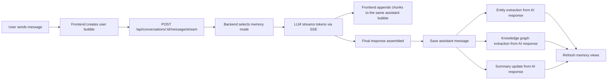

# ConversiQ

ConversiQ is a conversational AI platform that combines real-time chat, persistent memory, and knowledge graph visualization in one workspace.

It is built to solve the problem of short-lived chat sessions that lose context too quickly. ConversiQ keeps conversations connected by storing memory as structured entities, summaries, and graph relationships, while still letting the assistant respond in a natural chat interface.

## Project Overview

ConversiQ has two parts:

- A Flask backend that handles authentication-aware conversation storage, LLM calls, memory updates, export/import, and token tracking.
- A React + TypeScript frontend that provides the chat UI, memory inspector, knowledge graph, entity browser, stats page, and auth screens.

The platform supports multiple memory modes, streaming responses, and persistent conversations per user.

## Features

- Real-time AI chat with progressive streaming responses over SSE.
- Single-bubble streaming UI with an immediate “AI is thinking...” state.
- Persistent conversations backed by the database.
- Conversation search, pinning, archiving, deleting, and export/import.
- Persona-based assistant behavior with built-in personas seeded from `backend/data/personas.json`.
- Buffer Memory for regular chat history with token-aware truncation.
- Summary Memory that updates from the AI’s final response and recent context.
- Entity Memory that extracts named entities from AI responses and merges duplicates intelligently.
- Knowledge Graph Memory that extracts subject-predicate-object triples from AI responses.
- Sequential Memory that runs intent classification, response generation, entity extraction, KG extraction, and summary updating in order.
- Knowledge graph visualization for stored triples.
- Entity browser with category filters and entity counts.
- Token usage panel showing current context breakdown and total budget usage.
- Usage stats page with live totals from the backend.
- Responsive UI with sidebar navigation, memory inspector, and auth screens.

## Architecture

### Frontend Flow

- `Platform_design/src/app/App.tsx` owns the main UI state: auth, selected conversation, messages, active memory tab, and streaming state.
- `Platform_design/src/app/api.ts` is the single client layer for backend calls.
- The chat view appends the user message immediately, opens the SSE stream, and updates the same assistant bubble as chunks arrive.
- The memory panel fetches entities, graph data, summaries, and token stats from the backend.

### Backend Flow

- `backend/app.py` creates the Flask app, registers the blueprints, seeds built-in personas, and exposes `/api/health`.
- `backend/routes/conversations.py` handles conversation CRUD, message sending, and the SSE streaming endpoint.
- `backend/services/llm_client.py` builds the Groq-backed LangChain chat models.
- `backend/services/summary_memory.py`, `entity_memory.py`, and `kg_memory.py` update persistent memory after the final assistant response is available.
- `backend/models/database.py` stores conversations, messages, summaries, entities, triples, and personas.

### Request Lifecycle



## Memory System Documentation

### Buffer Memory

- Uses recent conversation history with token-aware truncation.
- Good for short sessions or when no structured memory is needed.

### Summary Memory

- Reads the latest stored summary plus recent messages for context.
- After the assistant finishes responding, the backend generates an updated summary from the AI response and recent conversation flow.
- The summary is stored as a new `ConversationSummary` row.

### Entity Memory

- Extracts named entities from the AI’s final response text.
- Filters greetings and generic filler.
- Deduplicates entities by normalized name.
- Merges descriptions and promotes stronger entity types when needed.

### Knowledge Graph Memory

- Extracts relationship triples from the AI’s final response text.
- Filters generic subject/predicate/object combinations.
- Deduplicates repeated triples.
- Stores triples for graph visualization and prompt context.

### Sequential Memory

- Classifies the user’s intent first.
- Generates the response using the best available context.
- Only after the final response is complete does it update entity memory, knowledge graph memory, and summary memory.
- Keeps all three memory systems synchronized with the same AI response source.

## Implementation Details

### AI Response Pipeline

1. The user sends a message.
2. The frontend shows an in-progress assistant bubble immediately.
3. The backend streams the assistant response over SSE.
4. The frontend appends chunks to the same bubble as they arrive.
5. When the stream ends, the final assistant text is saved.
6. Entity, graph, and summary updates run only from that final assistant response.

### Streaming Flow

- SSE is used for one-way token streaming from backend to frontend.
- The frontend keeps the same assistant message id throughout the stream.
- Markdown rendering is preserved while content grows progressively.
- Auto-scroll keeps the latest content visible during streaming.
- Abort handling prevents stale streams from updating the UI after cancellation or navigation.

### Entity Extraction Flow

- The backend sends the final assistant response into the entity extractor.
- The extractor asks the LLM for JSON only.
- The service normalizes names, removes generic terms, and merges duplicates.

### Graph Generation Flow

- The backend extracts triples from the final assistant response.
- Graph data is derived from stored triples.
- The frontend renders the graph with `react-force-graph-2d` and uses layout tuning for readability.

## Tech Stack

### Backend

- Flask
- Flask-CORS
- SQLAlchemy
- SQLite by default
- Gunicorn
- LangChain
- `langchain-groq`
- PyJWT
- python-dotenv

### Frontend

- React 18
- TypeScript
- Vite
- Supabase Auth client
- Motion
- Lucide React
- `react-markdown`
- `remark-gfm`
- `react-force-graph-2d`
- `d3-force`

## Setup Instructions

### Prerequisites

- Python 3.11.9 or compatible 3.11 runtime
- Node.js 18+
- npm

### Backend Setup

```bash
cd backend
python -m venv .venv
.venv\Scripts\activate
pip install -r requirements.txt
python app.py
```

### Frontend Setup

```bash
cd Platform_design
npm install
npm run dev
```

### Environment Variables

#### Backend (`backend/.env`)

```env
GROQ_API_KEY=your_groq_api_key
FLASK_SECRET_KEY=your_flask_secret
FLASK_DEBUG=True
SUPABASE_JWT_SECRET=your_supabase_jwt_secret
DATABASE_URL=sqlite:///conversional_ai.db
SUMMARY_INTERVAL=5
MAX_BUFFER_MESSAGES=20
TOKEN_BUDGET=4000
```

#### Frontend (`Platform_design/.env`)

```env
VITE_SUPABASE_URL=your_supabase_url
VITE_SUPABASE_ANON_KEY=your_supabase_anon_key
```

Note: the frontend currently points to `http://localhost:5000/api` in `Platform_design/src/app/api.ts`.

## Folder Structure

```text
README.md
backend/
	app.py
	config.py
	Procfile
	runtime.txt
	requirements.txt
	data/
		personas.json
	models/
		database.py
	routes/
		conversations.py
		export.py
		memory.py
		personas.py
	services/
		auth.py
		buffer_memory.py
		chain_builder.py
		context_manager.py
		entity_memory.py
		kg_memory.py
		llm_client.py
		memory_manager.py
		summary_memory.py
Platform_design/
	package.json
	pnpm-workspace.yaml
	index.html
	postcss.config.mjs
	vite.config.ts
	vite-env.d.ts
	assests/
		Artificial.lottie
	src/
		app/
			App.tsx
			api.ts
			supabaseClient.ts
		services/
			api.ts
		components/
			AuthScreen.tsx
			ConversationList.tsx
			CreatePersonaCard.tsx
			EntitiesScreen.tsx
			EntityDashboard.tsx
			GraphScreen.tsx
			KnowledgeGraph.tsx
			MemoryPanel.tsx
			MessageBubble.tsx
			PersonaSelector.tsx
			ProfileMenu.tsx
			StatsScreen.tsx
			Toast.tsx
			TokenUsage.tsx
			WelcomeScreen.tsx
			figma/
				ImageWithFallback.tsx
			ui/
		styles/
			fonts.css
			globals.css
			index.css
			tailwind.css
			theme.css
		types/
			index.ts
			d3-force.d.ts
```

## Screenshots

Add project screenshots here when available:

- Chat and streaming response screen: `docs/screenshots/chat-streaming.png`
- Memory inspector / entity browser: `docs/screenshots/memory-inspector.png`
- Knowledge graph view: `docs/screenshots/knowledge-graph.png`
- Usage stats / token panel: `docs/screenshots/stats-token-usage.png`

## API Endpoints

### Conversations

- `GET /api/conversations`
- `POST /api/conversations`
- `GET /api/conversations/<conv_id>`
- `PUT /api/conversations/<conv_id>`
- `DELETE /api/conversations/<conv_id>`
- `POST /api/conversations/<conv_id>/message`
- `POST /api/conversations/<conv_id>/message/stream`
- `GET /api/conversations/<conv_id>/tokens`
- `GET /api/conversations/<conv_id>/summary`
- `GET /api/conversations/<conv_id>/entities`
- `GET /api/conversations/<conv_id>/graph`

### Personas

- `GET /api/personas`
- `POST /api/personas`
- `GET /api/personas/<persona_id>`
- `PUT /api/personas/<persona_id>`
- `DELETE /api/personas/<persona_id>`

### Memory and Analytics

- `GET /api/entities/search?q=...`
- `POST /api/compare/memory`
- `GET /api/stats`

### Misc

- `GET /api/health`
- `POST /api/conversations/<conv_id>/export`
- `POST /api/conversations/import`

## Known Limitations

- Token analytics are snapshot-based only; there is no historical time-series chart endpoint yet.
- The frontend API base is hardcoded to the local backend URL in `src/app/api.ts`.
- The knowledge graph still uses `react-force-graph-2d`, which is interactive but not as structured as a layered DAG or Cytoscape-based layout.
- SSE is one-way streaming; there is no WebSocket channel for bidirectional realtime collaboration.

## Future Improvements

- Add a real token history endpoint if historical analytics are needed.
- Consider a structured graph library or DAG layout for larger knowledge graphs.
- Move the API base URL into environment-based configuration.
- Offload memory extraction to background jobs if response latency becomes a concern.

## Deployment Notes

- The backend includes a `Procfile` for Gunicorn deployment.
- The frontend is a Vite app and can be built with `npm run build` for static hosting.